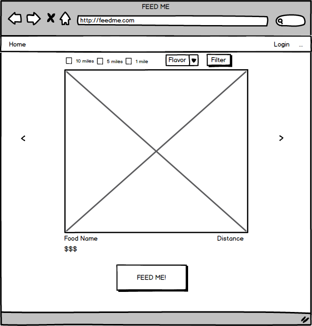
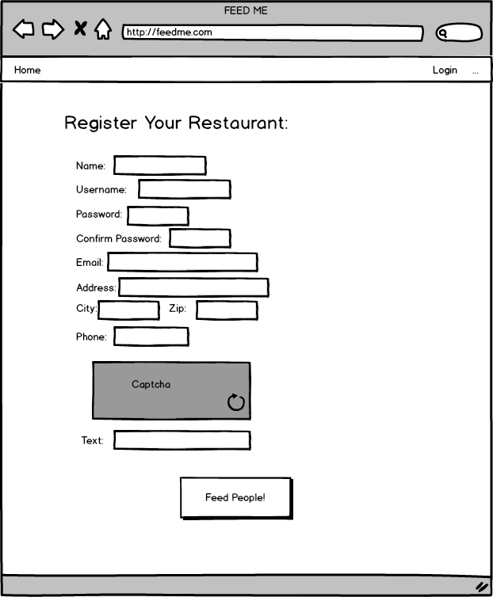
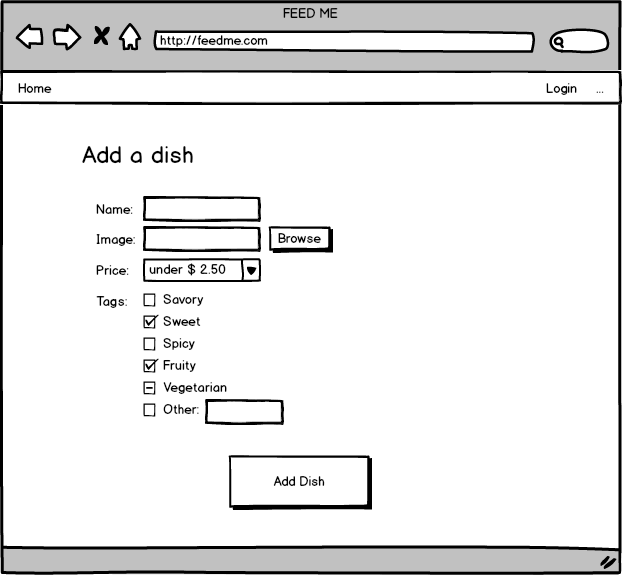
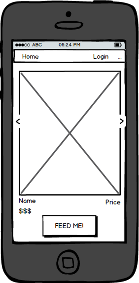

FeedMe
=======

Problem statement
-----------------
You're hungry but you don't know what for. 

Solution
--------
FeedMe provides quick suggestions through visual tastebud stimulation.
With one click, FeedMe sends you to a delivery service and allow you to
order the food.

User Experience
---------------
When a user comes to FeedMe they are presented with a mouth-watering picture of
a food item which has been posted by a local restaurant. In addition to the 
picture the user is given the title of the dish, the general price range, and 
the distance of the restaurant. If this particular food item has peaked their 
interest, the user can click FeedMe and will be redirected to the restaurant's 
GrubHub page where they can place their order. If the first picture doesn't 
quite do it for them, the user can simply click on the "next" arrow to bring 
them to a new random food item. If the client has a particular genre of food in 
mind they can filter which results are presented to them. This is essentially a 
new spin on the way people browse for and order food keying on visually 
delicious food.

Restaurant Experience
---------------------
When a restaurant first joins FeedMe they must register themselves. They create
an account with all of their relevant information as displayed in the 
wireframes. Once they have created their account, they are able to sign in and
upload pictures of their best-looking dishes to be displayed to potential 
customers. Restaurants will have incentive to post their pictures because it is
a form of self-promotion.  

Features (Pick 5)
-----------------
  1. Geolocation
  2. Server-side data persistence for password/account storing
  3. Front-end framework including Bootstrap
  4. Client-side data persistence (keep restaurants logged in)
  5. Emails: Send restaurants notifications about ordering trends

Data We Will Be Collecting
--------------------------
  * Data about participating restaurants
  	* Username
  	* Password
  	* Name
    * Address
    * Email
    * Their food items
  * Data about the food items
    * Image
    * Name
    * Price

Algorithms
----------
To successfully implement FeedMe we will need to program a randomizer algorithm
in order to give users a truly random plethra of food images to choose from. 
This can be implemented in a variety of ways. We may try to also provide images
based on how close the restaurants are to your current location. 

Wireframes
--------------------------
  
  
  

  

  
  
#Comments by Ming
1. Why isn't the README directly in the comp20-spring2015-team21 folder?
2. What you have listed for features are not features. Briefly describe for what will you be using SMS, reporting, geolocation for.
3. " truly random plethra of food images to choose from" --great, I'm going to get garbage
4. Please don't handle the actual ordering of the food.
5. What APIs will your team be using?
6. Overall score: 12/15
